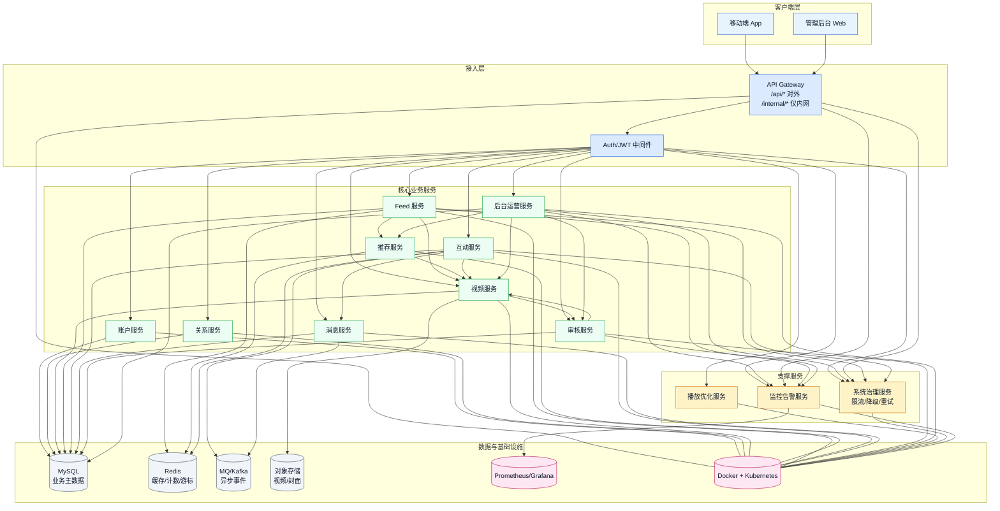
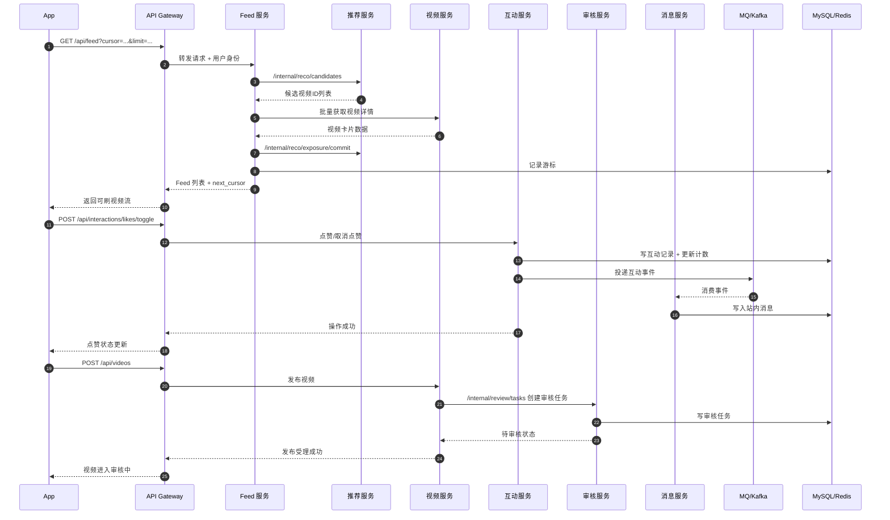

# 视频 Feed 系统架构图（MVP）

## 1. 总体分层架构

## 2. 核心链路时序（刷 Feed + 互动 + 审核）

## 3. 说明

- 对外统一走 `/api/*`，服务间调用走 `/internal/*`，用于明确安全边界。
- 互动、审核、消息通过事件解耦，保证主链路可用性和可扩展性。
- MVP 阶段优先保证主闭环：注册登录 -> 发视频 -> 刷 Feed -> 互动 -> 审核下架。
