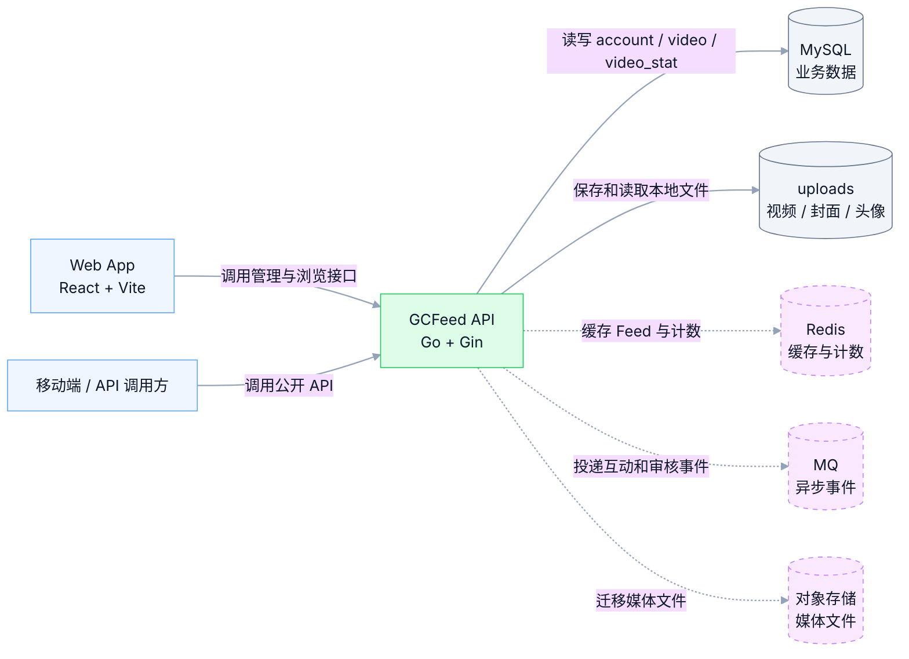
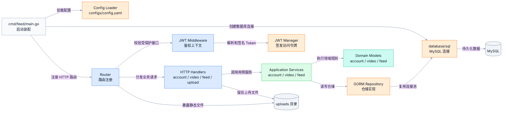
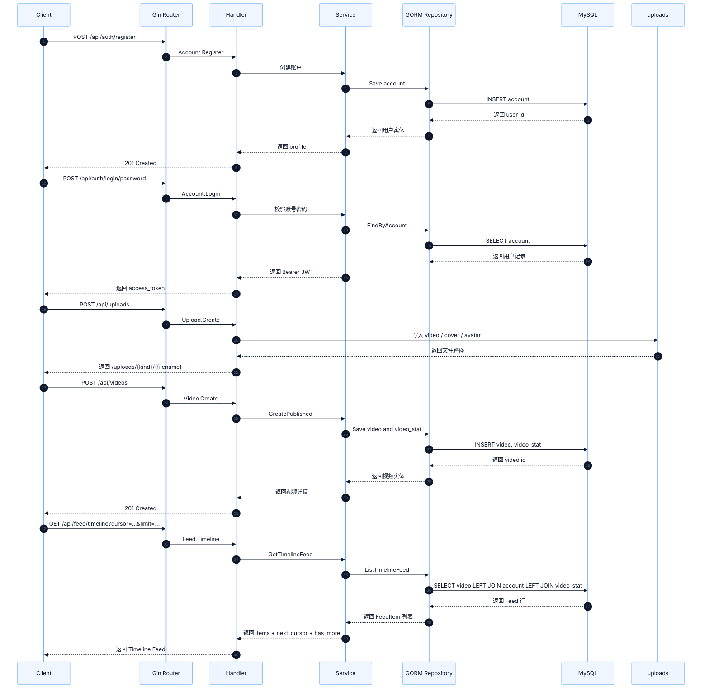
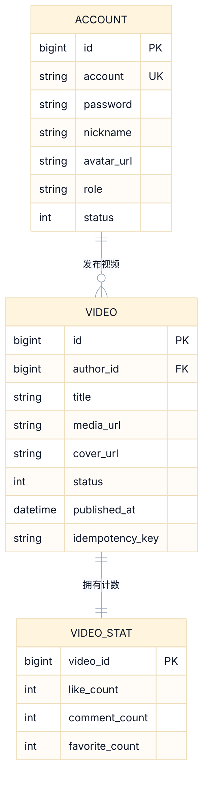
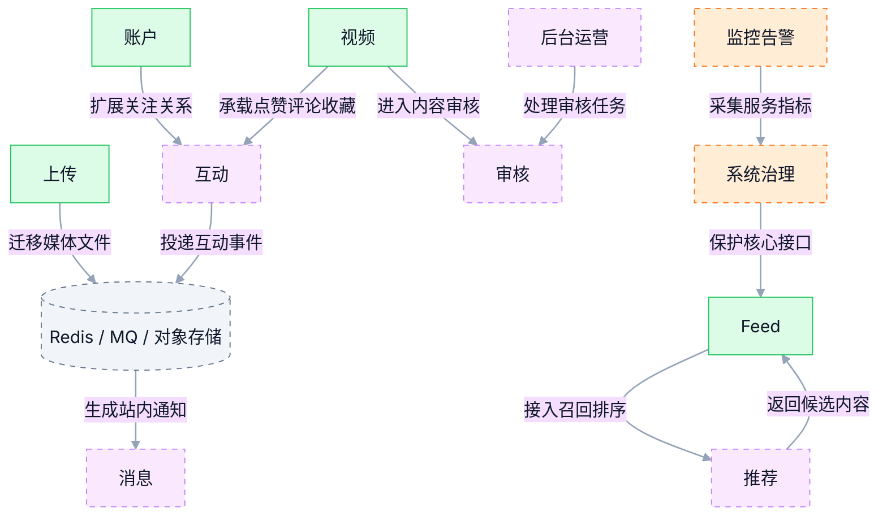

# 视频 Feed 系统架构图（MVP）

本文按 `mermaid-diagrams` skill 重构：每张图只表达一个概念，节点保持克制，连接线带语义标签，图前给出用途说明。当前实现以 Go API 单体承载账户、视频、Feed 与上传能力，后续能力以演进图呈现。

## 1. 系统上下文

这张图展示 GCFeed 与客户端、存储和演进型基础设施的边界。

## 2. API 内部分层

这张图展示 Go API 单体内部的主要代码层次和依赖方向。

## 3. 核心请求链路

这张图展示从注册、登录、上传、发布到刷 Feed 的 MVP 主链路。

## 4. 数据模型

这张图展示当前 GORM 自动迁移的三张核心表及 Feed 查询依赖。

## 5. 演进能力地图

这张图展示已落地闭环和后续模块的连接方式，虚线代表规划中的能力边界。

## 6. 说明

- 当前代码以 Go API 单体承载账户、视频、Feed 与上传能力，内部按接口层、应用层、领域层、基础设施层组织。
- 对外接口统一挂载在 `/api/*`，静态文件通过 `/uploads/*` 访问，健康检查使用 `/health`。
- 数据持久化使用 MySQL，GORM 自动迁移 `account`、`video`、`video_stat` 三张表。
- Feed 当前采用 Timeline 策略，按 `published_at DESC, id DESC` 排序，并通过 Base64 游标分页。
- 推荐、互动、审核、消息、治理和监控模块作为演进边界保留，后续可从单体内模块逐步扩展为异步事件和独立服务。
