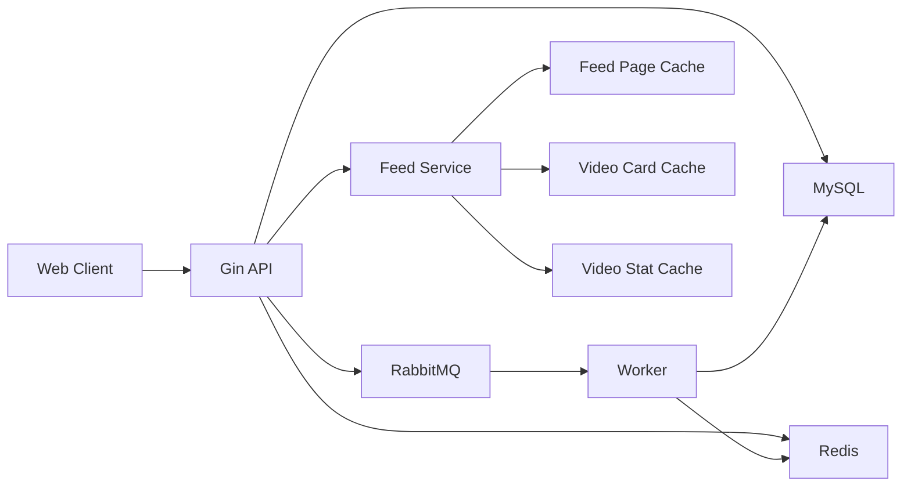

# GCFeed 性能与稳定性优化

本文沉淀 Feed 核心链路的性能问题、优化策略和验收指标。架构总览见 [architecture.md](architecture.md)，代码规范见 [engineering.md](engineering.md)。

## 1. 优先级边界

| 优先级 | 目标 | 典型问题 |
| --- | --- | --- |
| P0 | 保证首发可用 | Timeline 高访问、Feed 组装慢、游标重复、互动并发、缓存一致性 |
| P1 | 提升体验 | Hot 热 key、发布放大、预加载、播放 QoS |
| P2 | 支持扩展 | 多机部署、服务拆分、推荐特征、监控告警闭环 |

## 2. 核心架构



Redis 用于读性能和短期状态，RabbitMQ 用于削峰和异步落库，MySQL 保存最终事实。

## 3. P0 优化清单

| 编号 | 问题 | 策略 | 验收指标 |
| --- | --- | --- | --- |
| P0-01 | Timeline 首页大量访问 | 页缓存、短 TTL、singleflight 回源 | 首页 P95 响应稳定在可接受范围 |
| P0-02 | Feed 卡片组装慢 | 页缓存只存 ID，卡片和计数批量 MGET | 单页查询减少 N+1 回源 |
| P0-03 | 分页重复和漏数 | 游标携带排序字段，稳定排序 | 翻页结果无重复且顺序稳定 |
| P0-04 | 数据库缓存一致性偏差 | 写事实表，缓存短 TTL，异步更新 | 计数最终一致，缓存异常可回源 |
| P0-05 | 并发点赞收藏评论 | Redis 快速状态、RabbitMQ 异步落库、幂等键 | 重复请求计数稳定 |
| P0-06 | 大 V 发布放大 | 粉丝数阈值、异步 fanout、懒加载补偿 | 发布接口不被粉丝量线性拖慢 |
| P0-07 | 热门视频热 key | 分钟桶 ZSET、窗口合并、短期窗口缓存 | Hot 查询避免集中打 MySQL |

## 4. Timeline 访问

问题：Timeline 首页访问频率高，直接查询 MySQL 会把压力集中到 `video` 和 `video_stat`。

优化：

- `feed:page:v1:timeline:limit:{limit}:first` 保存首页排序结果。
- `feed:page:v1:timeline:limit:{limit}:cursor:{cursorHash}` 保存后续页。
- 页缓存只保存 `video_id` 和排序字段。
- Feed Service 通过批量 MGET 读取 `video:card` 和 `video:stat`。
- 回源时使用 singleflight 合并同 key 请求。

推荐 TTL：

| 缓存 | TTL |
| --- | --- |
| 首页页缓存 | 5 秒 + 抖动 |
| 后续页缓存 | 45 秒 + 抖动 |
| 视频卡片 | 15 分钟 |
| 视频计数 | 15 秒 |

## 5. Feed 卡片组装

问题：Feed 返回项需要视频主体、作者信息和计数，逐条查询会形成 N+1。

优化：

1. 页查询得到视频 ID 列表。
2. Redis 批量读取视频卡片和计数。
3. 缺失项批量回源 MySQL。
4. 回源结果写回 Redis。
5. 按原始排序组装响应。

验收：

- 单页 Feed 查询使用批量读取。
- Redis 缺失时最多一次批量视频查询和一次批量计数查询。
- 返回顺序与页缓存或数据库排序一致。

## 6. 游标分页

问题：只用 offset 翻页时，新视频插入会导致重复或漏数。

优化：

| 场景 | 排序 | 游标字段 |
| --- | --- | --- |
| Timeline | `published_at DESC, id DESC` | `published_at`、`video_id` |
| Hot | `hot_score DESC, video_id DESC` | `window_end`、`offset` |
| 评论 | `created_at DESC, id DESC` | `created_at`、`comment_id` |

验收：

- 同一排序字段下使用 ID 作为稳定次级排序。
- 游标解析失败返回 400。
- 多页查询结果无重复。

## 7. 缓存一致性

原则：

- MySQL 保存最终事实。
- Redis 保存短期状态、热榜和读缓存。
- 写路径优先保证事实安全。
- 读路径允许短 TTL 偏差。

互动写入：

```text
HTTP Handler
  -> Interaction Service
  -> Redis 行为状态和实时计数
  -> RabbitMQ ActionChangedEvent
  -> Worker
  -> MySQL interaction_action / interaction_comment / video_stat
```

异常处理：

| 异常 | 处理 |
| --- | --- |
| Redis 不可用 | 降级为 MySQL 路径或返回可识别错误 |
| RabbitMQ 投递失败 | 保留同步写入能力或记录失败任务 |
| Worker 重复消费 | 使用唯一键和幂等键保证安全 |
| 缓存计数偏差 | TTL 过期后回源修正 |

## 8. 发布放大

问题：作者发布视频后，如果同步写入所有粉丝 inbox，发布耗时会随粉丝数线性增长。

优化：

- 小粉丝量作者可同步写入关注流 inbox。
- 大粉丝量作者走 RabbitMQ fanout worker。
- 粉丝数超过阈值时按批次写 Redis inbox。
- 关注新作者时可回填作者近期视频。
- Redis inbox 保留固定长度，避免无限增长。

验收：

- 发布接口响应时间与粉丝数解耦。
- Worker 可重复消费同一发布事件。
- inbox 长度受控。

## 9. Hot Feed

Hot Feed 使用 Redis ZSET 维护一小时滑动窗口。

| 行为 | 分数 |
| --- | --- |
| 点赞 | +3 |
| 收藏 | +4 |
| 评论 | +5 |
| 取消点赞 | -3 |
| 取消收藏 | -4 |
| 删除评论 | -5 |

Key：

```text
feed:hot:minute:v1:{yyyyMMddHHmm}
feed:hot:window:v1:{windowEndUnix}
```

读取时合并最近 60 个分钟桶，移除分数小于等于 0 的条目，再按分数倒序分页。

## 10. 监控指标

建议指标：

| 指标 | 说明 |
| --- | --- |
| `feed_request_p95_ms` | Feed 请求 P95 |
| `feed_cache_hit_ratio` | Feed 页缓存命中率 |
| `video_card_cache_hit_ratio` | 视频卡片缓存命中率 |
| `interaction_queue_lag` | 互动队列积压 |
| `interaction_worker_error_count` | Worker 错误数 |
| `mysql_query_p95_ms` | MySQL 查询 P95 |
| `redis_error_count` | Redis 错误数 |
| `rabbitmq_publish_error_count` | MQ 投递错误数 |

## 11. 落地顺序

1. 先确保游标分页和批量组装稳定。
2. 再接入 Feed 页缓存、卡片缓存和计数缓存。
3. 再完成互动异步落库与 Worker 幂等。
4. 再补发布 fanout 和 Hot 窗口缓存。
5. 最后补监控指标和降级开关。
