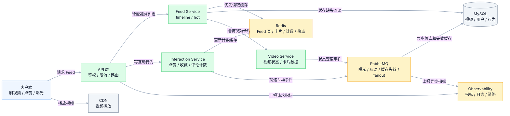
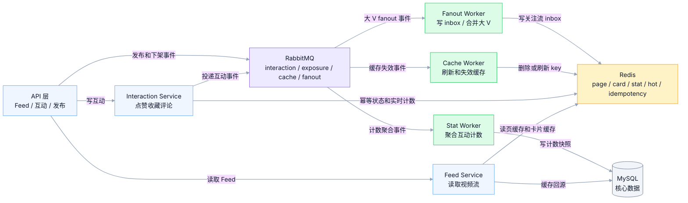
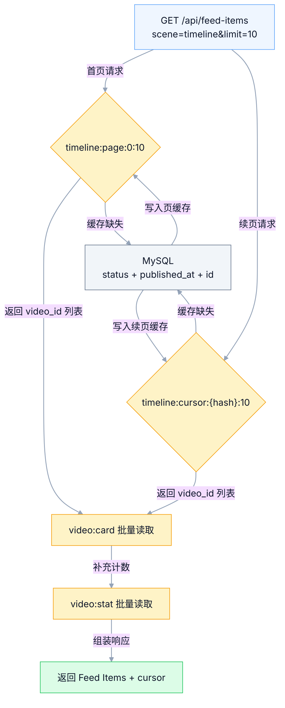
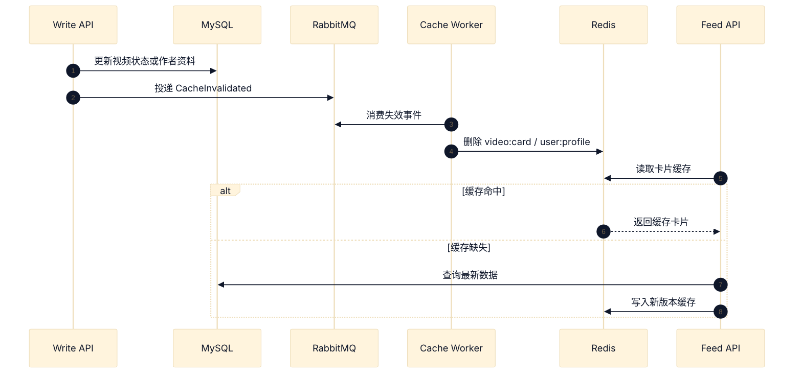
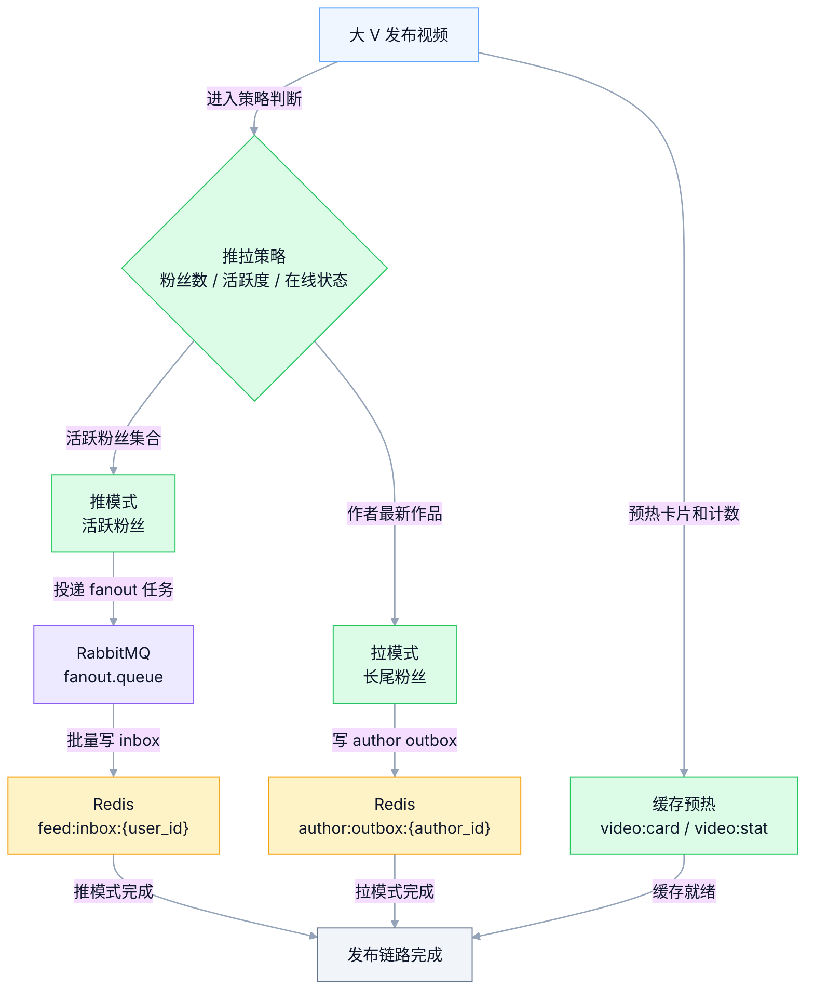
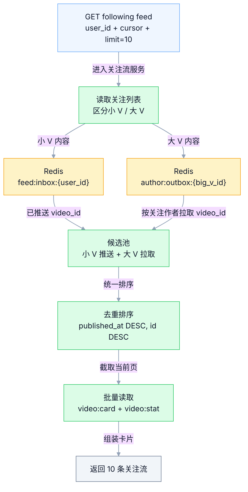
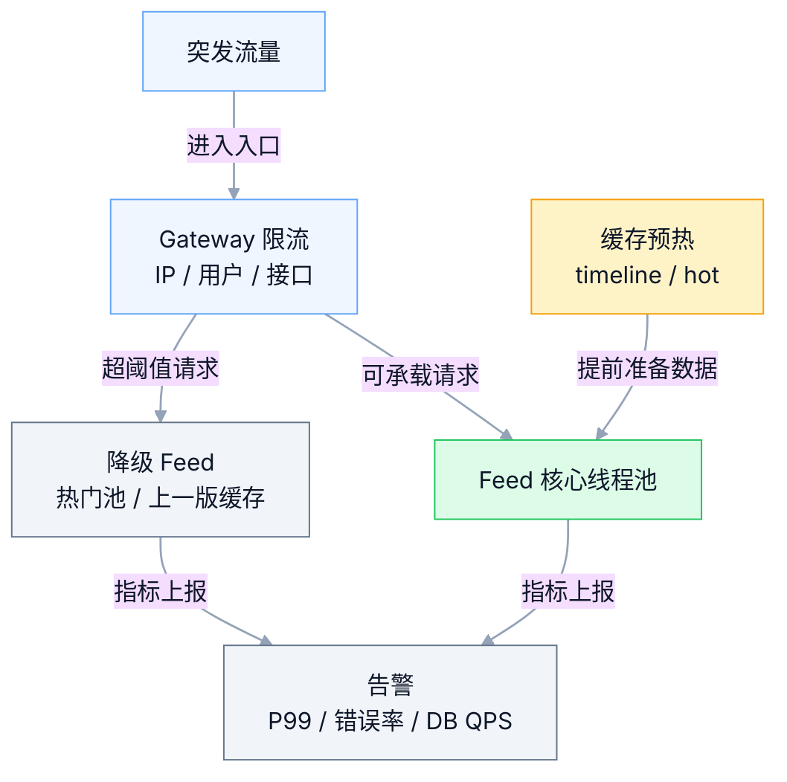
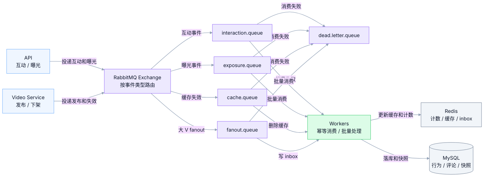
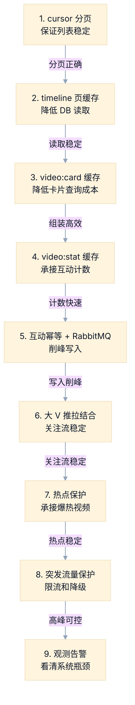

# GCFeed 视频 Feed 核心问题与优化方案

本文聚焦高性能视频 Feed 流系统中最核心、最热门、最典型的问题。目标是把 GCFeed 的优化重点放在刷视频主链路：Feed 读取稳定、分页结果正确、卡片组装高效、缓存一致性可控、热门视频可承压、互动写入可削峰、突发流量有保护、关键指标可观测。

## 1. 优先级边界

| 优先级 | 范围 | 目标 |
| --- | --- | --- |
| P0 | 刷视频主链路和核心数据正确性 | 保障 Feed 可用、分页稳定、缓存可控、互动计数正确 |
| P1 | 热门内容和高峰流量体验 | 保障热点视频、突发访问、曝光上报、视频播放体验 |
| P2 | 后续平台化能力 | 推荐策略平台、自动扩容、实验治理、成本治理 |

当前系统优先落地 P0 和 P1。P2 作为后续演进方向，用于系统规模继续增长后的工程治理。

## 2. 核心架构图



### 2.1 Redis 与 RabbitMQ 职责图

Redis 承担高频读和短期状态，RabbitMQ 承担削峰、异步、重试和事件解耦。Feed 主链路优先命中 Redis，写入类链路通过 RabbitMQ 把慢操作移到异步 Worker。



## 3. 问题排序

| 排序 | 问题 | 触发场景 | 影响 | 核心方案 | 验收指标 |
| --- | --- | --- | --- | --- | --- |
| P0-01 | Timeline 大量访问 | 用户集中打开首页、连续下拉刷新 | MySQL 读压力升高、Feed P95 升高 | 首页页缓存、游标分页、复合索引 | Feed P95、缓存命中率、DB QPS |
| P0-02 | Feed 卡片组装慢 | 每页 10 条视频逐条查询视频、作者、计数 | N+1 查询、响应时间拉长 | `video:card`、`video:stat`、批量 MGET | 卡片组装耗时、Redis 命中率 |
| P0-03 | 分页重复和漏数 | 新视频插入、视频下架、用户连续翻页 | 用户看到重复内容、翻页体验异常 | cursor 包含排序字段、scene、last_id | 重复率、漏数率 |
| P0-04 | 数据库缓存一致性偏差 | 视频更新、下架、作者改名、计数变化 | Feed 展示旧内容、计数偏差 | Cache Aside、事件失效、版本号、短 TTL | 缓存失效延迟、脏读率 |
| P0-05 | 并发点赞收藏评论 | 热门视频大量互动、客户端重试、快速连点 | 计数错误、重复行为、评论写入拥塞 | 行为幂等、Redis 计数、RabbitMQ 异步落库、评论分页缓存 | 互动 P95、计数延迟、重复记录数 |
| P0-06 | 大 V 发布放大 | 大 V 发布视频、粉丝集中刷新关注流 | 粉丝 inbox 写入风暴、关注流读取变慢 | 推拉结合、活跃粉丝推、长尾粉丝拉、RabbitMQ fanout | RabbitMQ fanout lag、following P95 |
| P0-07 | 热门视频热 key | 爆热视频进入首页、评论区和点赞高峰 | Redis 单 key 压力高、接口抖动 | 本地缓存、热点 key 分片、短 TTL、热点识别 | 热 key QPS、Redis CPU |
| P0-08 | 突发流量冲击 | 外部导流、大 V 发布、活动峰值、客户端重试 | P99 升高、错误率升高、DB 被打满 | 限流、缓存预热、降级 Feed、服务隔离、背压 | P99、错误率、限流数 |
| P0-09 | 缓存雪崩击穿穿透 | 大量 key 同时过期、热门 key 失效、非法 id 查询 | 请求集中回源、MySQL 压力飙升 | TTL 抖动、单飞加载、空值缓存、Bloom Filter | 回源 QPS、缓存重建耗时 |
| P0-10 | RabbitMQ 积压和重复消息 | 曝光、互动、缓存失效事件激增 | 消费延迟、计数重复、状态延迟 | 幂等消费、DLQ、重放工具、消费分区 | RabbitMQ lag、重复消费率 |
| P1-01 | MySQL 读写瓶颈 | Feed 回源、互动落库、评论写入增加 | 慢查询、锁等待、连接池耗尽 | 复合索引、读写分离、连接池隔离、批量写 | 慢查询、锁等待 |
| P1-02 | 曝光日志洪峰 | 用户快速滑动、自动播放、重复上报 | RabbitMQ 堆积、写入放大 | 批量上报、服务端去重、RabbitMQ 削峰 | RabbitMQ lag、曝光写入量 |
| P1-03 | 视频首帧慢 | 用户滑到新视频后立即播放 | 停留下降、滑走率升高 | CDN、封面预加载、下一条视频预连接 | 首帧耗时、卡顿率 |
| P1-04 | 观测盲区 | 高峰期接口变慢、缓存命中下降 | 排障耗时、问题定位慢 | RED 指标、Tracing、结构化日志、关键告警 | MTTD、MTTR |

## 4. P0-01 Timeline 大量访问

### 问题

Timeline 是视频 Feed 系统的主入口，请求量通常最高。首页内容在短时间内高度相似，所有请求直接访问 MySQL 会把数据库推到系统瓶颈位置。

### 典型触发场景

- 用户打开 App 进入首页。
- 用户连续下拉刷新。
- 大量新用户在活动期间进入系统。
- 客户端重试导致同一页重复请求。

### 优化方案

Timeline 读取使用“页缓存 + 卡片缓存 + 计数缓存”三层结构。页缓存保存 `video_id` 列表，卡片缓存保存视频展示信息，计数缓存保存点赞数、评论数、收藏数。



### 落地细节

- `timeline:page:0:{limit}` 保存首页 `video_id`，TTL 建议 3 秒。
- `timeline:cursor:{cursor_hash}:{limit}` 保存续页 `video_id`，TTL 建议 10 秒到 30 秒。
- MySQL 建复合索引：`(status, published_at DESC, id DESC)`。
- 发布新视频后刷新首页页缓存。
- 读库压力升高时返回上一版页缓存。

### 验收指标

| 指标 | 目标 |
| --- | --- |
| Feed P95 | 小于 100ms |
| 首页页缓存命中率 | 90% 以上 |
| MySQL Feed 查询 QPS | 稳定在可承载范围内 |
| 单次返回数量 | 10 条 |

## 5. P0-02 Feed 卡片组装慢

### 问题

Feed 列表返回的是完整视频卡片。每个卡片通常包含视频标题、封面、播放地址、作者昵称、作者头像、点赞数、评论数、收藏数。每条视频逐个查询会形成 N+1 查询。

### 优化方案

Feed Service 先查询 `video_id` 列表，再批量获取卡片和计数。

| 缓存 key | 数据内容 | TTL 建议 | 更新方式 |
| --- | --- | --- | --- |
| `video:card:v1:{video_id}` | 标题、封面、播放地址、作者昵称、作者头像、状态版本 | 15 分钟 | 视频或作者变更后失效 |
| `video:stat:v1:{video_id}` | 点赞数、评论数、收藏数、播放数 | 15 秒 | Redis 写入，异步同步 DB |
| `user:profile:{user_id}` | 昵称、头像、简介 | 5 分钟到 30 分钟 | 用户资料变更后失效 |

### 落地细节

- 使用 Redis MGET 一次读取多个 `video:card`。
- 使用 Redis MGET 一次读取多个 `video:stat`。
- 缓存缺失的视频卡片批量回源 MySQL。
- 回源结果写入 Redis，后续请求直接命中缓存。
- 返回字段固定，减少接口序列化成本。

### 验收指标

| 指标 | 目标 |
| --- | --- |
| 每页数据库查询次数 | 1 到 3 次 |
| `video:card` 命中率 | 90% 以上 |
| `video:stat` 命中率 | 95% 以上 |
| 卡片组装耗时 P95 | 小于 30ms |

## 6. P0-03 分页重复和漏数

### 问题

视频流持续有新视频发布，也会有视频下架。使用 offset 分页时，列表位置会随着数据变化移动，用户连续翻页容易看到重复视频或漏掉视频。

### 优化方案

Feed 使用 cursor 分页。cursor 记录当前场景、排序字段和最后一条视频的位置。

```json
{
  "scene": "timeline",
  "published_at": "2026-05-05T12:00:00Z",
  "last_id": 1024,
  "limit": 10
}
```

Timeline 查询条件：

```sql
SELECT *
FROM videos
WHERE status = 'published'
  AND (
    published_at < ?
    OR (published_at = ? AND id < ?)
  )
ORDER BY published_at DESC, id DESC
LIMIT 10;
```

### 落地细节

- cursor 使用 base64 JSON，便于调试和接口测试。
- cursor 包含 `scene`，保证 timeline、hot、recommend 各自独立。
- cursor 包含 `limit`，保证翻页数量稳定。
- cursor 可增加签名字段，防止客户端篡改。
- 服务端按 `published_at DESC, id DESC` 生成稳定顺序。

### 验收指标

| 指标 | 目标 |
| --- | --- |
| 连续翻 5 页重复 video_id | 0 |
| 每页数量 | 10 条 |
| 新视频插入后的历史翻页结果 | 保持稳定 |
| 下架视频出现在下一页结果 | 0 |

## 7. P0-04 数据库缓存一致性偏差

### 问题

视频 Feed 展示依赖数据库和缓存共同工作。视频下架、作者改名、封面更新、计数变化会让缓存里的数据和数据库出现短时间偏差。高性能系统允许部分计数秒级延迟，同时要求下架、删除、审核驳回这类状态快速生效。

### 优化方案

使用 Cache Aside 加事件失效。写请求先更新 MySQL，再投递缓存失效事件到 RabbitMQ，Worker 消费事件后删除或刷新 Redis。



### 落地细节

- 视频下架：删除 `video:card:v1:{video_id}`，Feed 查询时过滤 `status`。
- 作者改名：删除 `user:profile:{user_id}`，相关卡片下一次读取时刷新。
- 封面更新：删除 `video:card:v1:{video_id}`。
- 点赞计数：更新 Redis 计数，异步写入 MySQL 快照。
- 缓存值带 `updated_at` 和 `version`，便于定位旧数据来源。

### 验收指标

| 指标 | 目标 |
| --- | --- |
| 下架状态传播延迟 | 小于 3 秒 |
| 卡片缓存失效延迟 | 小于 5 秒 |
| 计数缓存延迟 | 小于 3 秒 |
| 缓存脏读率 | 持续下降并可观测 |

## 8. P0-05 并发点赞收藏评论

### 问题

热门视频会出现大量点赞、收藏、评论请求。同一个用户可能快速连点，客户端也可能因为网络超时重试。系统需要同时保证行为幂等、接口快速返回、计数最终正确、评论列表稳定展示。

### 优化方案

互动请求先做幂等校验，再更新 Redis 计数，随后通过 RabbitMQ 异步写 MySQL 行为表和计数快照。评论写入采用同步写主记录、异步刷新计数和热评缓存的方式。

```mermaid
---
config:
  theme: base
  layout: dagre
  themeVariables:
    background: transparent
    fontFamily: Inter, PingFang SC, Microsoft YaHei, Arial
    primaryTextColor: "#0F172A"
    lineColor: "#94A3B8"
---
flowchart LR
  classDef api fill:#EFF6FF,stroke:#60A5FA,color:#0F172A,stroke-width:1px;
  classDef cache fill:#FEF3C7,stroke:#F59E0B,color:#0F172A,stroke-width:1px;
  classDef async fill:#DCFCE7,stroke:#22C55E,color:#0F172A,stroke-width:1px;
  classDef store fill:#F1F5F9,stroke:#64748B,color:#0F172A,stroke-width:1px;

  Req["互动请求<br/>like / favorite / comment"]
  Idem["幂等键<br/>user_id + video_id + action"]
  Stat["Redis 计数<br/>video:stat"]
  RabbitMQ["RabbitMQ<br/>InteractionEvent"]
  DB["MySQL<br/>行为表 / 评论表"]

  Req -->|"校验行为"| Idem
  Idem -->|"有效互动"| Stat
  Idem -->|"重复请求返回当前状态"| Req
  Stat -->|"投递事件"| RabbitMQ
  RabbitMQ -->|"异步落库和聚合"| DB

  class Req api;
  class Idem,Stat cache;
  class RabbitMQ async;
  class DB store;
  linkStyle default stroke:#94A3B8,stroke-width:1.4px
```



### 落地细节

- 点赞和收藏行为表建立唯一键：`user_id + video_id + action`。
- Redis 保存用户行为状态：`interaction:{user_id}:{video_id}:{action}`。
- Redis 保存视频计数：`video:stat:v1:{video_id}`，字段包含 `like_count`、`favorite_count`、`comment_count`。
- 评论主记录同步写 MySQL，保证评论详情可查询。
- 评论计数通过 Redis INCR 快速返回，再异步写 MySQL 快照。
- 评论列表使用 cursor 分页，热门视频评论第一页进入短 TTL 缓存。
- RabbitMQ 消费端按唯一键幂等写入，重复消息只返回已有状态。
- 定时任务对 Redis 计数和 MySQL 快照做校准。

### 验收指标

| 指标 | 目标 |
| --- | --- |
| 点赞收藏接口 P95 | 小于 80ms |
| 评论发布接口 P95 | 小于 150ms |
| 重复互动产生的重复行为记录 | 0 |
| 计数同步延迟 | 小于 3 秒 |
| RabbitMQ 消费延迟 | 小于 5 秒 |

## 9. P0-06 大 V 发布放大

### 问题

大 V 发布视频会同时影响关注流、推荐流、热门流和消息通知。粉丝量很大时，发布瞬间向所有粉丝 inbox 写入会形成写入风暴；所有粉丝集中刷新关注流时，读取链路也会被放大。

### 优化方案

大 V 问题使用推拉结合。活跃粉丝走推模式，发布后通过 RabbitMQ fanout 异步写入粉丝 inbox；长尾粉丝走拉模式，大 V 最新作品写入 author outbox，用户读取关注流时再拉取并合并。系统通过作者等级、粉丝数、近期活跃粉丝数、粉丝在线状态决定推拉比例。

发布时的推拉策略：



用户读取关注流时的推拉合并：



### 落地细节

- 普通作者走全量推模式：`feed:inbox:{user_id}` 写入 `video_id`。
- 大 V 活跃粉丝走部分推模式：在线粉丝、近期活跃粉丝优先写 inbox。
- 大 V 长尾粉丝走拉模式：维护 `author:outbox:{author_id}`。
- 关注流读取时合并用户 inbox 和关注大 V 的 author outbox。
- 合并排序使用 `published_at DESC, id DESC`，并按 `video_id` 去重。
- Fanout 任务进入 RabbitMQ，按粉丝分片并发消费。
- inbox 只保存最近 N 条 `video_id`，控制 Redis key 长度。
- author outbox 只保存大 V 最近 N 条公开视频。
- 大 V 发布后预热 `video:card`、`video:stat`、封面和首段 CDN。
- 消息通知走独立队列，保障 Feed 主链路资源隔离。

### 验收指标

| 指标 | 目标 |
| --- | --- |
| 大 V 发布接口 P95 | 小于 200ms |
| fanout RabbitMQ lag | 可观测并持续回落 |
| following 读取 P95 | 小于 150ms |
| 单个用户 inbox 长度 | 控制在固定上限 |
| 大 V 视频卡片缓存预热成功率 | 99% 以上 |

## 10. P0-07 热门视频热 key

### 问题

爆热视频会被大量用户同时刷到，点赞数、评论数、卡片详情会成为 Redis 热 key。单个 key 的 QPS 过高时，Redis CPU、网络带宽和接口 P99 都会抖动。

### 优化方案

热点视频使用多层缓存和分片计数。

| 数据 | 方案 | 说明 |
| --- | --- | --- |
| 视频卡片 | 本地缓存 + Redis | 热门视频卡片短时间稳定，适合进程内缓存 |
| 点赞计数 | 分片 key | `video:like:{video_id}:{shard}` 分摊写压力 |
| 评论数 | Redis 计数 + 异步聚合 | 高峰期优先保障接口速度 |
| 热点识别 | QPS 阈值 | 超过阈值后进入热点保护策略 |

### 落地细节

- 热点视频卡片本地缓存 TTL 1 秒到 3 秒。
- Redis 计数拆成 16 个或 32 个分片。
- 读取计数时聚合多个分片。
- 热点视频发布后提前预热 `video:card`。
- Redis 慢命令和大 key 进入告警。

### 验收指标

| 指标 | 目标 |
| --- | --- |
| 单 key QPS | 低于 Redis 风险阈值 |
| Redis CPU | 保持稳定 |
| 热点视频 Feed P99 | 小于 200ms |
| 热点识别延迟 | 小于 10 秒 |

## 11. P0-08 突发流量冲击

### 问题

突发流量来自外部导流、大 V 发布、活动峰值、客户端重试。系统需要把流量挡在入口、把核心链路资源隔离、把缓存提前准备好。

### 优化方案



### 落地细节

- API 层按用户、IP、接口设置限流。
- Feed 读取线程池和互动写入线程池隔离。
- 活动开始前预热 timeline 首页和 hot 首页。
- 推荐服务超时时返回热门 Feed。
- DB QPS 超阈值时提高缓存 TTL。

### 验收指标

| 指标 | 目标 |
| --- | --- |
| Feed P99 | 小于 300ms |
| 错误率 | 小于 1% |
| 降级返回成功率 | 99% 以上 |
| 限流日志 | 可查询、可聚合 |

## 12. P0-09 缓存雪崩击穿穿透

### 问题

缓存雪崩来自大量 key 同时过期，缓存击穿来自热门 key 瞬间失效，缓存穿透来自大量非法 id 查询。三类问题都会让请求集中回源 MySQL。

### 优化方案

| 问题 | 触发条件 | 方案 |
| --- | --- | --- |
| 雪崩 | 大量 Feed 页缓存同一时间过期 | TTL 加随机抖动，核心 key 分批刷新 |
| 击穿 | 热门视频卡片缓存失效 | 单飞加载，本地短缓存，热点 key 预热 |
| 穿透 | 大量非法 `video_id` 查询 | Bloom Filter，空值缓存，请求限流 |

### 落地细节

- `timeline:page` TTL 使用基础值加随机抖动。
- 热门 `video:card` 使用单飞加载，同一时刻只有一个请求回源。
- 查询空结果写入短 TTL 空值缓存。
- Bloom Filter 保存已发布视频 id。
- 回源 QPS 进入告警，超过阈值触发降级。

### 验收指标

| 指标 | 目标 |
| --- | --- |
| 缓存回源 QPS | 稳定可控 |
| 热门 key 重建耗时 | 小于 100ms |
| 非法 id 命中空值缓存比例 | 持续上升 |
| Redis 命中率 | 90% 以上 |

## 13. P0-10 RabbitMQ 积压和重复消息

### 问题

Feed 系统大量依赖异步事件：曝光、点赞、收藏、评论计数、缓存失效、大 V fanout。RabbitMQ 积压会造成数据延迟，重复消息会造成计数重复或缓存反复失效。

### 优化方案

- 事件带全局 `event_id`。
- 消费端使用幂等表或 Redis 幂等 key。
- 不同事件拆分 routing key 和 queue：`interaction`、`exposure`、`cache_invalidate`、`fanout`。
- 高优先级事件单独队列，例如视频下架和缓存强失效。
- 消费失败进入 DLQ，提供重放工具。
- RabbitMQ lag 进入告警，超过阈值扩容 Consumer。



### 验收指标

| 指标 | 目标 |
| --- | --- |
| RabbitMQ lag | 小于 5 秒 |
| 重复消费造成的数据错误 | 0 |
| DLQ 消息 | 可查询、可重放 |
| 高优先级缓存失效延迟 | 小于 3 秒 |

## 14. P1-01 MySQL 读写瓶颈

### 问题

Feed 回源、互动落库、评论写入都会消耗 MySQL。高并发下常见瓶颈是慢查询、锁等待、连接池耗尽、索引失效。

### 优化方案

- Feed 查询建立复合索引：`status, published_at, id`。
- 行为表建立唯一索引：`user_id, video_id, action`。
- 评论表按 `video_id, created_at, id` 支持评论分页。
- Feed 读请求走读库，互动写请求走主库。
- 连接池按服务隔离，Feed、互动、后台任务分开配置。
- 批量写入计数快照，降低小事务数量。

### 验收指标

| 指标 | 目标 |
| --- | --- |
| 慢查询数 | 持续下降 |
| 锁等待 | 可观测并低于阈值 |
| 连接池等待时间 | 可观测并低于阈值 |
| Feed 回源查询耗时 P95 | 小于 50ms |

## 15. P1-02 曝光日志洪峰

### 问题

用户快速滑动视频会产生大量曝光事件。曝光事件直接写数据库会带来写入放大，也会影响 Feed 主接口。

### 优化方案

- 客户端批量上报曝光事件。
- 服务端只做轻量校验和去重。
- 曝光事件写入 RabbitMQ，由 Worker 异步消费。
- 使用 `user_id + video_id + scene + minute` 做去重维度。
- 曝光表按时间分区，便于后续统计。

### 验收指标

| 指标 | 目标 |
| --- | --- |
| 曝光上报接口 P95 | 小于 50ms |
| RabbitMQ lag | 小于 5 秒 |
| 曝光重复写入率 | 持续下降 |
| Feed 接口受曝光写入影响 | 可观测、可隔离 |

## 16. P1-03 视频首帧慢

### 问题

视频 Feed 的体验由首帧耗时强烈影响。用户滑到视频后，播放器需要快速拿到封面、视频首段和播放地址。

### 优化方案

- 视频文件走 CDN。
- Feed 卡片中返回播放地址和封面地址。
- 客户端预加载下一条视频封面。
- 客户端对下一条视频建立连接。
- 热门视频首段提前预热 CDN。

### 验收指标

| 指标 | 目标 |
| --- | --- |
| 首帧耗时 | 小于 500ms |
| 播放卡顿率 | 持续下降 |
| CDN 命中率 | 95% 以上 |
| 滑动后可播放成功率 | 99% 以上 |

## 17. P1-04 观测盲区

### 问题

Feed 系统出现慢请求时，需要快速判断瓶颈位置：API、Redis、MySQL、RabbitMQ、CDN、客户端网络。缺少指标会让排查依赖猜测。

### 优化方案

| 模块 | 指标 |
| --- | --- |
| Feed API | QPS、P95、P99、错误率、返回条数 |
| Redis | 命中率、ops、CPU、慢命令、热 key |
| MySQL | 慢查询、连接数、锁等待、回源 QPS |
| RabbitMQ | 生产速率、消费速率、lag、失败数、DLQ 数 |
| 互动 | 点赞 P95、重复请求数、计数延迟 |
| 播放 | 首帧耗时、卡顿率、CDN 命中率 |

### 落地细节

- 每个请求带 `request_id`。
- Feed 响应日志记录 `scene`、`limit`、`cache_hit`、`db_fallback`。
- Redis 命中率低于阈值触发告警。
- RabbitMQ lag 超过阈值触发告警。
- 慢查询自动记录 SQL 和索引信息。

### 验收指标

| 指标 | 目标 |
| --- | --- |
| 问题发现时间 MTTD | 小于 1 分钟 |
| 问题定位时间 MTTR | 持续下降 |
| Feed 慢请求日志覆盖率 | 100% |
| 核心告警误报率 | 可接受 |

## 18. 系统优化点总览

| 方向 | 优化点 | 优先级 |
| --- | --- | --- |
| Feed 读取 | 页缓存、cursor、批量卡片组装、上一版缓存兜底 | P0 |
| Feed 写入 | 发布事件、缓存失效、RabbitMQ fanout、大 V 推拉结合 | P0 |
| 互动系统 | 点赞收藏幂等、评论分页、Redis 计数、异步落库 | P0 |
| 缓存系统 | TTL 抖动、单飞加载、空值缓存、Bloom Filter、热 key 分片 | P0 |
| 数据一致性 | Cache Aside、版本号、Outbox、幂等消费、补偿任务 | P0 |
| RabbitMQ | Exchange 路由、队列拆分、DLQ、重放、lag 告警 | P0 |
| 数据库 | 复合索引、读写分离、连接池隔离、批量写、慢查询治理 | P1 |
| 突发流量 | 入口限流、服务隔离、缓存预热、降级 Feed、背压 | P0 |
| 视频播放 | CDN、首段预热、封面预加载、播放地址缓存 | P1 |
| 观测 | QPS、P95、P99、错误率、缓存命中率、DB 回源、RabbitMQ lag | P0 |

## 19. 推荐落地顺序



实施顺序：

1. cursor 分页。
2. timeline 首页页缓存。
3. `video:card` 和 `video:stat` 批量缓存。
4. 数据库缓存一致性失效事件。
5. 点赞收藏评论幂等、Redis 计数、RabbitMQ 异步落库。
6. 大 V 推拉结合策略。
7. 热点视频保护。
8. 突发流量限流和降级。
9. Feed 核心指标和告警。

## 20. 总体验收指标

| 指标 | 目标 |
| --- | --- |
| Feed 每页数量 | 10 条 |
| Timeline 首页缓存 TTL | 3 秒 |
| Feed P95 | 小于 100ms |
| Feed P99 | 小于 300ms |
| Redis 命中率 | 90% 以上 |
| 连续翻页重复数 | 0 |
| 下架传播延迟 | 小于 3 秒 |
| 点赞收藏接口 P95 | 小于 80ms |
| 评论发布接口 P95 | 小于 150ms |
| 互动计数延迟 | 3 秒以内 |
| 大 V fanout lag | 可观测并持续回落 |
| RabbitMQ 消费延迟 | 5 秒以内 |
| 首帧耗时 | 小于 500ms |
| 核心慢请求日志覆盖率 | 100% |
